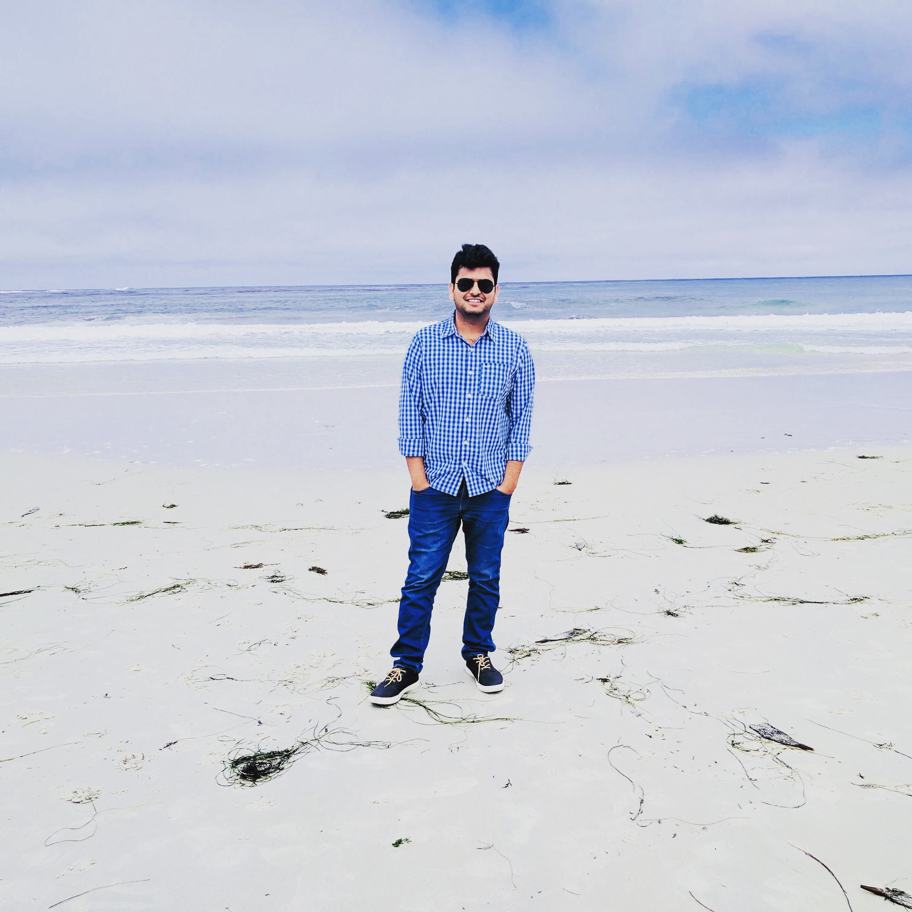

This is the project repo for the final project of the Udacity Self-Driving Car Nanodegree: Programming a Real Self-Driving Car. For more information about the project, see the project introduction [here](https://classroom.udacity.com/nanodegrees/nd013/parts/6047fe34-d93c-4f50-8336-b70ef10cb4b2/modules/e1a23b06-329a-4684-a717-ad476f0d8dff/lessons/462c933d-9f24-42d3-8bdc-a08a5fc866e4/concepts/5ab4b122-83e6-436d-850f-9f4d26627fd9).

# Team introduction
|              |     Name      | Location | LinkedIn | Image |
|--------------|---------------|----------|----------|--------------------------------|
| __Team Lead__| Guy Pavlov | San Jose, CA | [linkedin.com/in/guypavlov](https://linkedin.com/in/guypavlov) |  |
|Member| Aaron | | | |
|Member| Jay Teguh | Indonesia | [linkedin.com/in/jaycode](https://linkedin.com/in/jaycode) |  |
|Member| Shubham | Santa Clara, CA | [linkedin.com/in/shubham1](https://linkedin.com/in/shubham1) | 

# Installation and Usage

### Native Installation

* Be sure that your workstation is running Ubuntu 16.04 Xenial Xerus or Ubuntu 14.04 Trusty Tahir. [Ubuntu downloads can be found here](https://www.ubuntu.com/download/desktop).
* If using a Virtual Machine to install Ubuntu, use the following configuration as minimum:
  * 2 CPU
  * 2 GB system memory
  * 25 GB of free hard drive space

  The Udacity provided virtual machine has ROS and Dataspeed DBW already installed, so you can skip the next two steps if you are using this.

* Follow these instructions to install ROS
  * [ROS Kinetic](http://wiki.ros.org/kinetic/Installation/Ubuntu) if you have Ubuntu 16.04.
  * [ROS Indigo](http://wiki.ros.org/indigo/Installation/Ubuntu) if you have Ubuntu 14.04.
* [Dataspeed DBW](https://bitbucket.org/DataspeedInc/dbw_mkz_ros)
  * Use this option to install the SDK on a workstation that already has ROS installed: [One Line SDK Install (binary)](https://bitbucket.org/DataspeedInc/dbw_mkz_ros/src/81e63fcc335d7b64139d7482017d6a97b405e250/ROS_SETUP.md?fileviewer=file-view-default)
* Download the [Udacity Simulator](https://github.com/udacity/CarND-Capstone/releases/tag/v1.2).

### Docker Installation
[Install Docker](https://docs.docker.com/engine/installation/)

Build the docker container
```bash
docker build . -t capstone
```

Run the docker file
```bash
docker run -p 127.0.0.1:4567:4567 -v $PWD:/capstone -v /tmp/log:/root/.ros/ --rm -it capstone
```

### Usage

1. Clone the project repository
```bash
git clone https://github.com/udacity/CarND-Capstone.git
```

2. Install python dependencies
```bash
cd CarND-Capstone
pip install -r requirements.txt
```
3. Make and run styx
```bash
cd ros
catkin_make
source devel/setup.sh
roslaunch launch/styx.launch
```
4. Run the simulator

### Real world testing
1. Download [training bag](https://drive.google.com/file/d/0B2_h37bMVw3iYkdJTlRSUlJIamM/view?usp=sharing) that was recorded on the Udacity self-driving car (a bag demonstraing the correct predictions in autonomous mode can be found [here](https://drive.google.com/open?id=0B2_h37bMVw3iT0ZEdlF4N01QbHc))
2. Unzip the file
```bash
unzip traffic_light_bag_files.zip
```
3. Play the bag file
```bash
rosbag play -l traffic_light_bag_files/loop_with_traffic_light.bag
```
4. Launch your project in site mode
```bash
cd CarND-Capstone/ros
roslaunch launch/site.launch
```
5. Confirm that traffic light detection works on real life images

# Architecture
This is the system architecture for this project, we have not worked on obstacle detection as part of this implementation.


## Perception

The perception part in this project is mainly concerned with detecting the state of traffic lights and publishing the results (red/yellow/green/none) to ROS node `/traffic_waypoint` to be consumed by the `waypoint_updater` node.

### Traffic Light Detection and Classification

The traffic light detection is broken up into two parts. Part one deals with light localization and capture. Part two uses the captured light image (30x60 pixels) to classify the light as red, yellow, or green. 

For part one, localization, we use the 3D coordinate space of the vehicle in conjunction with the light waypoint data to find a 2D bounding box around the next closest light (if there is one). This is done by creating a translation, camera, and rotation matrix and then applying a linear transformation to the 3D point vector. 

Part two, classification, requires an accurate capture of the traffic light. A support vector machine (SVM) was trained against approximately 1000 captured images, using a histogram of the color space as  input features. The SVM does a very good job of classifying lights in the simulator, but it is less accurate with real world image capturing. 

Upon classifying the image, the class is published to other nodes. After a set number of consecutive classifications, the vehicle is confident in the measurement and decides what to do based on the light color.

## Planning
This module determines the vehicle path using various inputs like: vehicle's current position, velocity, and the state of various traffic lights along the way. It has two main nodes: 

1. **Waypoint loader:** This node loads the static waypoint data (CSV) and publishes to `/base_waypoints` 
 
2. **Waypoint updater:** This is the main planning node. This node subscribes to three main topics:
  - `/current_pose` The vehicle's current position.
  - `/base_waypoints` List of all waypoints, and
  - `/traffic_waypoint` Waypoint ID of the next red traffic light. Note that when the next traffic light is green, this node publishes `None` value. "Next" here is defined as "within 80 waypoints ahead of the vehicle", or in other words, that range is the visibility of our vehicle.

### Gradual stopping for traffic light

When a red traffic light is visible, the system sets all waypoints within 23 meters leading to the stopping line to have a gradually decreasing speed. The gradual decrease was calculated by a simple linear trajectory with a rate of `(1/n) * normal_speed` where `n` is the number of waypoints in that runway. So for example, if we had 23 waypoints covering the entire 23 meters runway, and the normal speed was 23 meters/second, then the speed at the waypoints would subsequently 23, 22, 21, down to 0 m/s right in front of the stopping line.

The waypoint updater node then publishes all 80 waypoints ahead of the vehicle to `/final_waypoints` topic.

## Control
This module handles the vehicle's throttle, brake, and steering based on the provided list of waypoints to follow. We use a PID controller for each of these three components.

Brake PID uses negative of difference in actual and expected velocity. With max value of full brake, on red lights.

Throttle PID uses difference in actual and expected velocity. Here we set brake to zero as we are accelerating.

Steering PID is used for steering control. It takes the required angle for the vehicle movement and give corresponding steering wheel angle. 

It has two main nodes:

1. **Waypoint follower:** This node uses [pure pursuit](https://www.mathworks.com/help/robotics/ug/pure-pursuit-controller.html?requestedDomain=www.mathworks.com) algorithm that allows the vehicle to smoothly follows a given trajectory. A couple of aspects to note here:
  - The node subscribes to `/final_waypoints` topic to get its trajectory from (which is simply a list of waypoints).
  - We adjusted the pure pursuit algorithm **not** to adjust the target linear velocity. In other words, it was only allowed to adjust the target angular velocity. The reason for this was to get the node to pass the same target linear velocity value as the waypoint updater node. Throttle and Brake PIDs would then use this target linear velocity to adjust when and how strong to throttle and brake.
  - Publish the twist command (target linear and angular velocities) to `/twist_cmd` topic.

2. **Twist controller** This node subscribes to `/twist_cmd` to get the target linear and angular velocities, and `/current_velocity` to get the current velocity. It then uses PID controllers to adjust actuator commands to follow the target velocities given the current velocity.

### Tuning PID Controllers

The tuning for each PID controller was done as follows:

1. We started with a tiny P coefficient. The vehicle would initially not actuate enough to reach the target component (throttle, brake, or steering error).
2. Increase the P coefficient until the adjusted value slightly overshoots but reasonably follows the target component. In steering, for example, the vehicle would oscillate within the center lane.
3. We then adjusted the D coefficient with a similar method as above: start from a small value, then increase until we reach a point of diminishing return. The end result here was a movement that oscillated very slightly with a smooth throttle and brake transition.
4. Brake PID controller was done a bit differently. With braking, we first tried to find the right P and D coefficients to achieve full-stop within 20 waypoints, then measure the distance of these 20 waypoints (in meters). We then finally store that value + some buffer as the system's `brake_start` configuration, which was found to be 23 meters in this case.
 
# Results

Initial submission (V.0):

[](https://www.youtube.com/watch?v=-CaE_pZjoi0)


# Known issues/ Future work

## More robust speed control near traffic light

Imagine the vehicle was driving at full speed while being close to stopping line and the traffic light was green but about to change to red. When the traffic light turns to red, there is a probability that the vehicle would not have enough time to stop in time. A more robust speed control is likely needed here, perhaps by reducing the vehicle's speed despite the traffic light's current state. A more advanced technique may involve adjusting the speed appropriately depending on the green light's elapsed time, just [like humans do](https://www.youtube.com/watch?v=GuY4FR-bmGY&list=RDGuY4FR-bmGY&t=12).